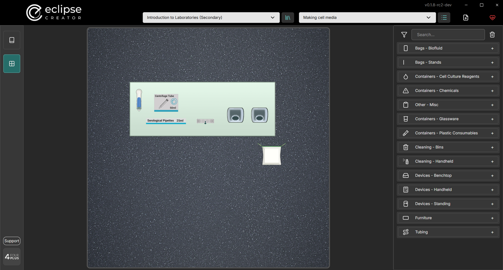
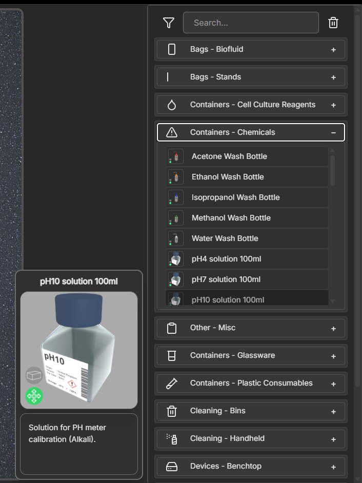
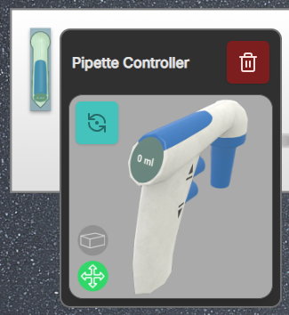
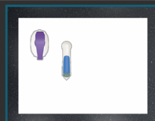
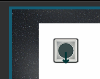

# Eclipse Creator Desktop

Eclipse Creator is a desktop app for the creation, customisation, and management of SOPs or training content. This section will outline the various controls used to navigate Eclipse Creator, along with sharing resources for user support. Below is a short tutorial video to help get you started:

<iframe width="560" height="315" src="https://www.youtube.com/embed/cO5zo4jYbww?si=yWqmQectOFGCqTqg" title="YouTube video player" frameborder="0" allow="accelerometer; autoplay; clipboard-write; encrypted-media; gyroscope; picture-in-picture; web-share" referrerpolicy="strict-origin-when-cross-origin" allowfullscreen></iframe>

## Navigation

Use the toolbar at the top to navigate between Collections and SOPs. Each Collection can contain multiple SOPs. This is useful for organising sets of training protocols per process, or subject.
Only one SOP can be edited at a time. Select a Collection from the Collections dropdown, then select a SOP from the SOP dropdown to see the contents.
You may import Collections from a local file, and export them to save a copy on a file. When importing, Collections will be overwritten if they share the same name. To prevent overwriting a Collection or SOP, give it a different name from the one you are importing.
SOPs can be transferred between collections. They also follow the same importing rules as Collections.
You can perform all these actions from the dropdown menus next to the Collection and SOP selection fields, respectively.

Use the Upload button on the toolbar to send updated data to connected headsets. Data sync can also be requested in the Eclipse Creator VR app by pressing the Sync button in the SOP interface.

Toggle the sync state of a Collection or SOP to prevent it from being accessible in the Eclipse Creator VR application. To apply any changed sync states, you should send the data to the connected headsets or have a user request a data update from the VR application.

> A currently engaged SOP will not be interrupted if the sync state changes, it will only be removed from the available SOPs in the VR SOP interface.

|                                                                                                                     |                                              |
|---------------------------------------------------------------------------------------------------------------------|----------------------------------------------|
|     | A SOP or Collection available for VR play.   |
|  | A SOP or Collection unavailable for VR play. |

Lastly, in the navigation bar, the connection state can be viewed. A Green icon indicates that there is at least one VR experience connected to the Eclipse Creator Desktop application. A red icon indicates that there are no VR experiences currently connected.

|                                                                                                                      |                                                                                                                                                             |
|----------------------------------------------------------------------------------------------------------------------|-------------------------------------------------------------------------------------------------------------------------------------------------------------|
|  | Connection to headset is inactive (synchronization not possible). Headset may be in "sleep mode" or not connected to the same network.                      |
|     | Connection to headset is active (synchronization possible). To connect, users must connect to the same network and open the Eclipse Creator app in headset. |

## Sidebar

Use the sidebar to switch between the Step view and the Layout view. In the Steps view, protocol steps can be defined. In the Layout view, the user can choose from a library assets to populate the virtual laboratory.

## SOP Steps Editor

Use the Steps editor to define a set of actions for the user to perform in the selected SOP. These should be defined in order, as they will be presented one by one to the user in the VR experience. For best practice, keep each step brief and don't require too many actions. There is a character limit applied per step (300) as less verbose instructions are preferred for learning in VR.

Use the function buttons on the left to add, remove, and insert steps. Optionally, make use of keyboard shortcuts for quick navigation.

## SOP Layout Editor

Use the layout editor to create the virtual laboratory for your SOP. The square area represents a 2 m by 2 m space for VR training. It's essential to account for the physical space limitations when designing a layout that is both safe and functional.

Search for assets in the library. Use the filter feature to show entries only from the chosen category. Hover over entries to see more detailed information about the asset.

Drag a selected asset into the grid and place is in the desired location. Click on an asset to see more information, and use the function buttons to remove the asset, or rotate it.

|                                                                                                                                         |                                                                                                                                               |
|-----------------------------------------------------------------------------------------------------------------------------------------|-----------------------------------------------------------------------------------------------------------------------------------------------|
|                          | Dispenser (blue if dispenser). Dispensers offer unlimited supply of a consumable. These consumables are portable once taken from a dispenser. |
|                             | Portable (green if portable). Small instruments and vessels may be portable in headset and so the user can reposition them.                   |
|  | Remove asset from layout.                                                                                                                     |
|  | Rotate asset by 90 degrees.                                                                                                                   |

To start, choose an appropriate work surface such as a laboratory table, an MSC cabinet, or a Fume Hood. Then place any required assets on this surface. Anything not placed on a surface will appear on the floor. Large devices should be placed on the floor, smaller appliances are better suited for placement on other surfaces.

**Clearing**: Click the bin icon to clear your layout and remove all placed objects.

**Placement**: Object placement should be carefully considered before finalising the layout in the SOP builder. Assets labelled as not portable have fixed positions once the user enters the headset.

>*Note: Consider creating multiple SOPs if multiple assets are required at different times and do not fit within the restricted area all together.*

>*Note: If the MSC becomes crowded, consider placing portable assets outside the MSC with Ethanol Spray available so that they can be sterilised and transferred in headset.*

**Orientation**: Certain instruments have arrows depicting their forward direction.

