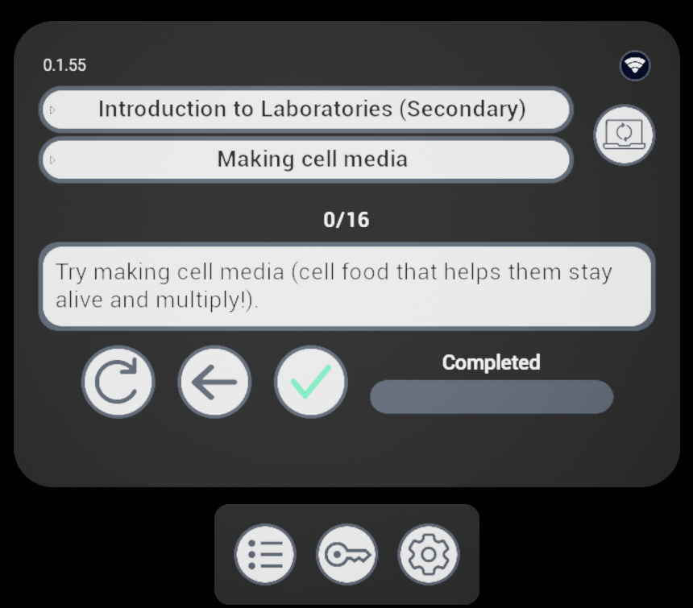
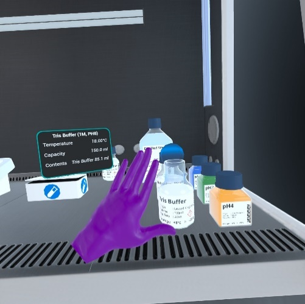
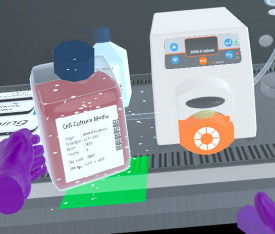
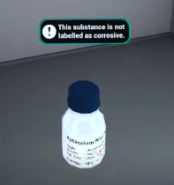

# Eclipse Creator VR

Eclipse Creator is a mixed-reality app for the delivery of hands-on technical laboratory training. Following the creation of SOPs/protocols using the desktop app, Eclipse Creator can be loaded in headset and both the instructional content and objects overlaid onto a real-world environment. This will guide trainees through protocols whilst allowing minimally restricted interaction with devices, equipment and consumables. Below is a short tutorial video to help get you started:

<iframe width="560" height="315" src="https://www.youtube.com/embed/mf7EQQI9ALA?si=huxhfKlhWOegKZXb" title="YouTube video player" frameborder="0" allow="accelerometer; autoplay; clipboard-write; encrypted-media; gyroscope; picture-in-picture; web-share" referrerpolicy="strict-origin-when-cross-origin" allowfullscreen></iframe>

## Prerequisites

Before launching Eclipse Creator, configure your play area in the virtual reality headset. Eclipse Creator is designed to be a standing experience that requires an area of approximately 2.5 m by 2.5 m that is free of clutter or obstacles for a safe and comfortable experience.

## First Time Setup

Upon the first launch of Eclipse Creator, a demo protocol will be loaded. This is available to all users to experience a limited demo of the app without needing to have a valid licence. Once a valid licence has been submitted, the following features will become available:

- Synchronisation with the Eclipse Creator Desktop app
- Loading and saving of custom SOPs

To enter the licence, use the navigation buttons at the bottom of the interface to navigate to the Licencing menu. Tap the input field to bring up the system keyboard and enter your Eclipse Creator licence.

## Controls and Interfaces

Most of the menus are contained within the main interface. This is a 3D UI that you can grab and reposition around the play area. The following is a navigation map:

| Button                                                                                                                                           | Menu                | Purpose                                                        |
|--------------------------------------------------------------------------------------------------------------------------------------------------|---------------------|----------------------------------------------------------------|
| { width=80 height=80 }                 | SOP Interface       | Choose Collection/SOP, progress current SOP, view sync status. |
| { width=80 height=80 } | Licensing Interface | Enter a licence, see licence state.                            |
| { width=80 height=80 }  | Settings            | Customise the app experience.                                  |

**SOP Interface**: Use this interface to select a Collection & SOP for training. The upper dropdown menu allows selecting a Collection, and once selected, the lower dropdown menu can be used to select a SOP. Once selected, the virtual laboratory will initialise and training can begin. This interface also shows the current SOP step and provides a navigation menu to move between the current SOP steps. The user can use the complete button to mark the current step of the SOP as complete and increment their training progress.

| Button                                                                                                                                                | Function                                       |
|-------------------------------------------------------------------------------------------------------------------------------------------------------|------------------------------------------------|
| { width=80 height=80 }            | Replay Text to Voice readout for current step. |
| { width=80 height=80 } | Navigate to the previous SOP Step.             |
| { width=80 height=80 }             | Navigate to the previous SOP Step.             |
| { width=80 height=80 }          | Complete current SOP Step.                     |

| Status                                                                                                                                                       | Meaning                                                                                  |
|--------------------------------------------------------------------------------------------------------------------------------------------------------------|------------------------------------------------------------------------------------------|
| { width=60 height=60 }    | The VR experience is synchronised to the desktop app and data can be transferred.        |
| { width=60 height=60 } | The VR experience is not synchronised to the desktop app and data cannot be transferred. |

**Quick menu**: Looking at the palm of your virtual hand and holding it horizontally will open the quick menu. This contains several elements:

- Current SOP step instructions & SOP progress
- SOP navigation menu (same as SOP Interface)
- App function menu

You may use this menu as an alternative to navigate the current SOP, to read steps and mark them as complete as training is progressed. The additional functions are as follows:

| Button                                                                                                                                                      | Function                                    |
|-------------------------------------------------------------------------------------------------------------------------------------------------------------|---------------------------------------------|
| { width=80 height=80 }                   | Recenter main interface to users' position. |
| { width=80 height=80 } | Center play area to users' position.        |
| { width=80 height=80 }                                        | Quit app.                                   |

## Hand Gestures

Eclipse Creator is designed to be a controller-free experience that utilises hand tracking technology. As such, to interact with the app, you will use natural hand gestures. The following gestures are built into the experience:
- Closed fist: pick up medium to large objects.
    - Thumb curl: while held, some objects can be controlled by moving the thumb, e.g. transferring liquid via mechanical pipettes.
    - Index curl: while held, some objects can be controlled by moving the index finger, e.g. using the spray bottle, or the sereological pipette controller.
    - Middle finger curl: while held, some objects can be controlled by moving the middle finger, e.g. expelling liquid via the sereological pipette controller.
- Index & Thumb pinch: pick up small objects and parts of tubing/wires.
- Tap: tap objects with the index finger to interact, e.g. bottle lids, and device lids.
- Tap on UI: use interfaces by tapping, holding, and dragging with the index finger.
- Face palm while holding horizontally: open quick menu.

>Note: There is no distinction for left hand versus right. Gestures can be performed by either hand.

## Feature Notes

**Dispensers**: Single-use consumables and boxes of pipettes/vials come in the form of a boxed dispenser. This means that they hold indefinite numbers of that asset. The assets can be accessed by either pinching or grabbing at the box.

>Note: Pipette tips come within the dispenser category but these can be connected to the pipette in the same way in which you would in the laboratory, by pressing the device into the box.

**Interactions**: Asset interactions include: grabbing, pinching, connecting, ejecting, withdrawing, spraying etc. To understand how interactions are performed, we highly recommend you access the tutorial either via our website or via email.

**Info panels**: Instrument info panels provide information about its properties. This includes: names of objects, temperatures, volumes, sterility, and consumable state. This information panel can be viewed by bringing your hand to an object.

**Attachment**: When object interactions are possible, users will be shown a blue preview of the held object in the attached position. If an object can be placed on a surface space, the area will appear green and if not, it will appear red.

**Warnings**: Warnings will occur if the user attempts to do something hazardous or which could be deemed as improper technique.

**Sanitisation**: Certain instruments have a sterile state. If starting on a basic work surface, these are considered non-sterile. If starting inside of an MSC, these will be sterile by default. The user will be prompted with a warning when moving non-sterile objects or their hands into the MSC. Objects can be sterilised by spraying them with Ethanol spray.

**Temperature**: Liquids and liquid containers, as well as certain other assets, carry a temperature value. This value can be altered by heating, centrifuging, freezing, refrigerating, or thawing the item. Temperature is maintained when not actively being altered to allow the user to practice in confidence and not impose time limits on them.

**Fluids**: Eclipse Creator features a wide array of liquids and powders. These can be mixed inside containers via various liquid transfer methods, such a pouring, pumping, or pipetting. Use the info panel to see the contents of a container. Fluids also have temperature and pH values which can be measured.

**Consumable**: Some items have a certain number of uses, commonly as single-use items. This is reflected in the info panel. In some cases a user may be prevented from using a consumable item more than once.

**Disposal**: Lots of items are disposable and can be placed in various bins. These tend to come in dispensers to users may replace them as needed.