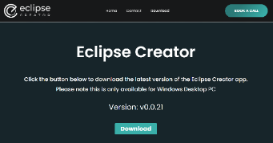
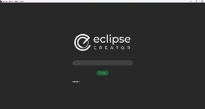

# Eclipse Creator Desktop Installation

Below is a guide for the installation of the Eclipse Creator desktop app.

On your desktop/laptop, navigate to the webpage [here](https://eclipsecreator.com/fourplus-vr-training-download/):

*If you experience this pop-up, choose to trust and keep the file and report as safe:*

- Run the installer for Eclipse Creator on desktop.
- Open the Eclipse Creator desktop app.
- Enter the licence key:

*This will be contained in an email from a FourPlus representative and be a 24-digit, alphanumeric string. It may be referred to as 'Eclipse Creator Desktop Licence'. Ensure this is not shared with anyone outside your institution.*

- Once your licence has been validated, you can gain access to the pre-installed default collection of SOPs.

>This Default collection will include six pre-made SOPs to get users started.

For Eclipse Creator Desktop application guidance, follow [here](../application-guidance/eclipse-creator-desktop.md).

## App Updates

Periodically, you will see a prompt in the bottom-right corner of the application that an update is available. Click this to download the installer of the latest version and run through it like in the steps above.

> It is recommended to keep the Eclipse Creator software up to date to have access to all the latest content and features.

Make sure to not tick the "Delete the application data" option when uninstalling or your Collections will be removed.

## Network

Eclipse Creator requires an active internet connection to use. Connect both the desktop and VR applications to the same network to sync your data and experience your protocols in VR.