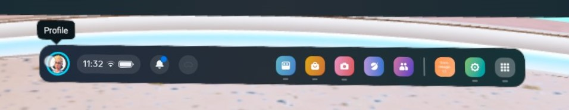
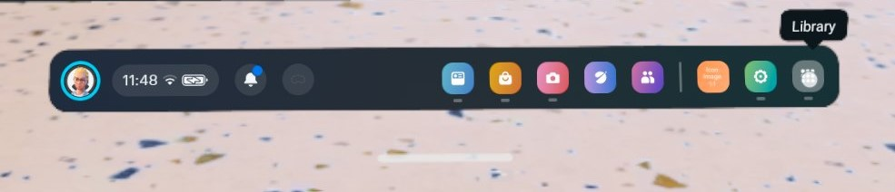
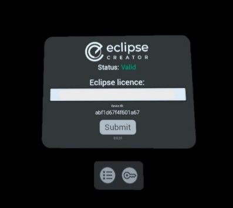

# Eclipse XR Installation

## Set up of new VR headsets (Meta Quest)

- Unbox the headset and controllers.
- Following this, gently pull the plastic blocker tabs from the controller.
- Charge headsets and replace batteries in controllers if required.  
- Put the headset on, adjusting head fittings using the tightening wheel (back) and head strap (top) for comfort and safety as required. 
- Press and hold the button on the left side of the headset for approx. three seconds. This will turn the headset on. 
- Perform any system updates prompted by the headset by following the on-screen instructions.
- Follow any required steps for account set up.

**There is more help and information for setting up your headset [here](equipment-and-hardware-setup.md).**

## Set up of Network connection

*During this phase, you will be met by a request to connect to the internet. This is not easily done when using a locked network such as Eduroam; thus, is it recommended to perform the initial set up on a less restricted (but trusted) network, such as a home network.*

- To connect to a new network, click on Wi-Fi and select it under the Wi-Fi menu on the headset. 
- Once an internet connection has been established, the headsets will update.
- Wait for updates to download and install and do not interrupt this process.
- Once set up, you can enter/exit passthrough mode by tapping on the side of the headset twice.

>We recommend operating with passthrough enabled to perform software installations. This allows a view of a laptop screen and licence code without the need to constantly remove and replace the headset, which can be uncomfortable/time-consuming.

If you require any additional assistance with setting up your Meta Quest headset, visit [Meta](https://www.meta.com/en-gb/help/quest/).

## Adding Eclipse XR to your library

Below is a guide for the installation of the Eclipse XR app to Meta headset. First, you must add Eclipse XR to your Meta account or Meta organisation.

*Ensure you have access to your Meta account-associated email and find the emails from FourPlus which give you your licence keys. Once you have validated your licence keys, you can access the full version of the VR app on the Meta Horizon platform.*

### Finding Eclipse XR in the headset

- Find the navigation bar. You may need to perform a pinch gesture aimed at the headset to bring it up: 

- Select Meta Horizon Store.
- Search for Eclipse XR.
- Select the application and add it to your account.

> Eclipse XR on Meta Horizon Store is free. Licences for the full software can be purchased from FourPlus.

### Finding Eclipse XR on the web store

- Navigate to Eclipse XR on Meta Horizon Store [here](https://www.meta.com/en-gb/experiences/eclipse-creator/8182073581808204/).
- Ensure you are logged into your Meta account.
- Press Get.
- Eclipse XR will now be in your Meta library.

## Launching Eclipse XR

Navigate to the Library on the Meta Quest and select Eclipse XR to launch/install it.

## App updates

Eclipse XR will automatically receive updates through the Meta Horizon platform. If there is an update, you will be prompted to install it when launching the app. There is no requirement to manually manage app updates.

## Network

Eclipse XR requires an active internet connection to be launched. If you do not have an active connection, the app launch will be prevented. Ensure you are connected to a network to use Eclipse XR.

## Entering your licence key

Access to full app functionality will be limited until a valid licence has been entered. Enter your Eclipse XR licence in the Licensing menu through the main interface. Refer to the [application guidance](../application-guidance/eclipse-xr.md) for more information on how to navigate through the XR app.
Your Eclipse XR licence key is unique to your institution, so it must not be shared.  When inputting this key while wearing the VR headsets, it is advised to first copy the key into a blank text document and size up the font until you can read it comfortably while in passthrough.

Once the licence has been validated, you will be able to experience all the features of Eclipse XR. If the network set up has been performed correctly, the Collections present in Eclipse XR Desktop should reflect those loaded in the VR app and automatically sync.

>Note: expired licences will return as Invalid. Contact FourPlus to extend your licence.

**If you experience any problems when trying to install or update the XR app, then visit our [FAQs](../faqs.md).**
